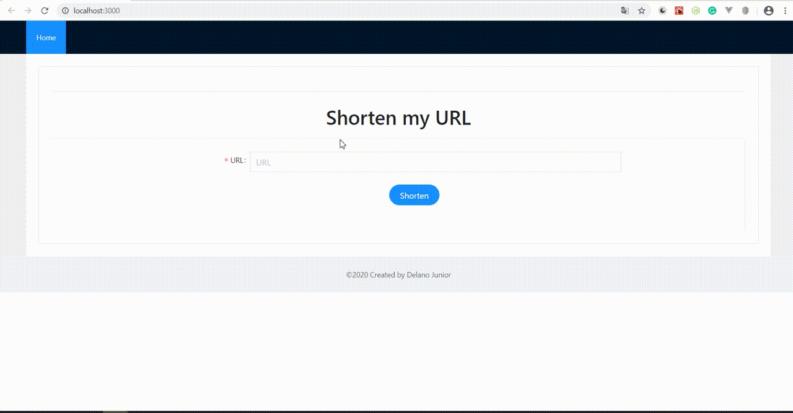

# Shorten URL App
### simple app to shorten your URL in case of share the URL on platforms with limited characters.

## Demo

## Stack
### Backend
- Node JS - 10.16.3
- NPM - 6.4.1
- Express - 4.17.1
  
### Frontend
- React - 16.13.1
- Axios - 0.19.2
  
### Database
- Sequelize - 5.21.6
  
### Test
- Jest - 25.4.0 **(Backend)** 
- SuperTest - 4.0.2 **(Backend)**
- Jest - **(Frontend. Integrated with React)**

## Setup
### Client
Navigate to the client folder and using **npm** install all dependencies using the following command:

`npm install`

After downloading all dependencies, use the following command to run the **frontend**:

`npm start`

### Server
Navigate to the server folder and using **npm** install all dependencies using the following command:

`npm install`

After downloading all dependencies, use the following command to run the **backend**:

`npm start`

If you have nodemon installed in your environment, you can use for hot reload, using the command:

`nodemon`

### Alternative way
From the **server** folder you can also run both projects **frontend** and **backend**, using [concurrently](https://www.npmjs.com/package/concurrently), performing the following command:

`npm run dev`

### Run tests
From the **server** folder, perform the following command to run unit tests:

`npm test`